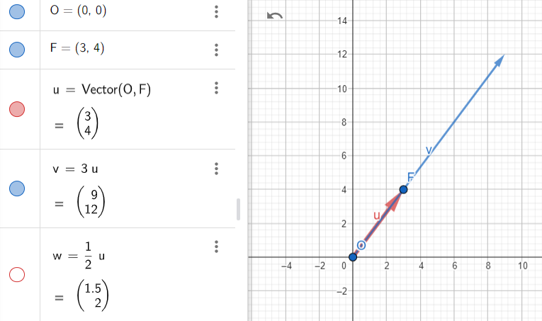
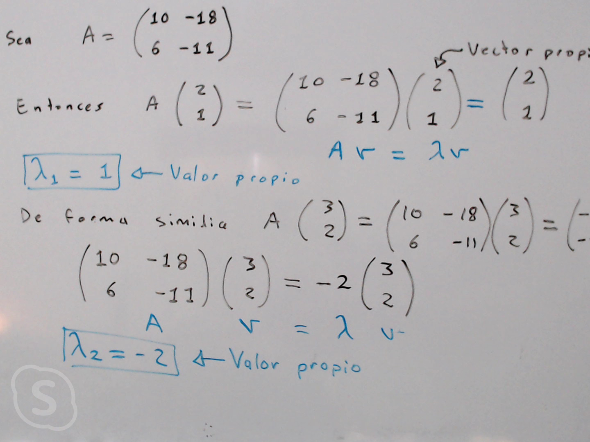
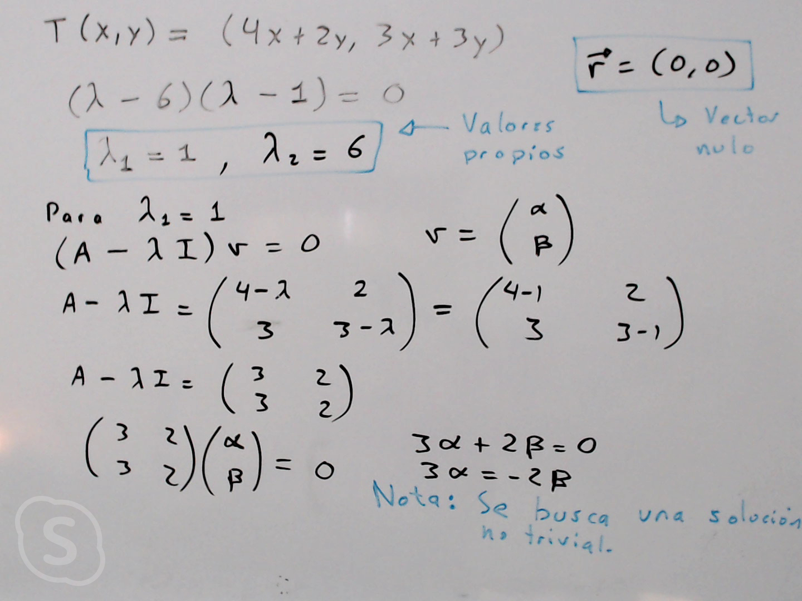
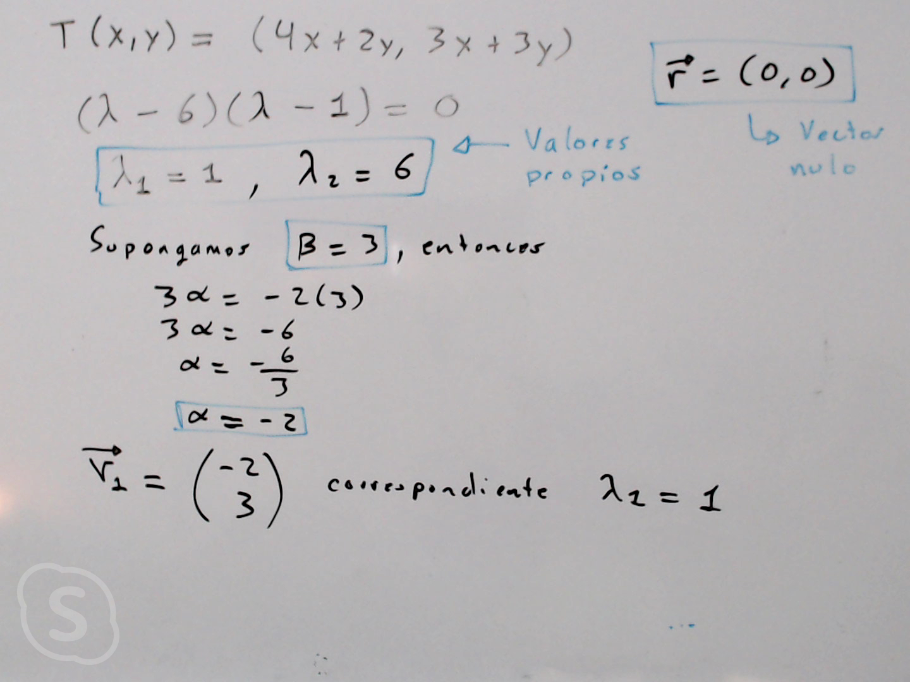
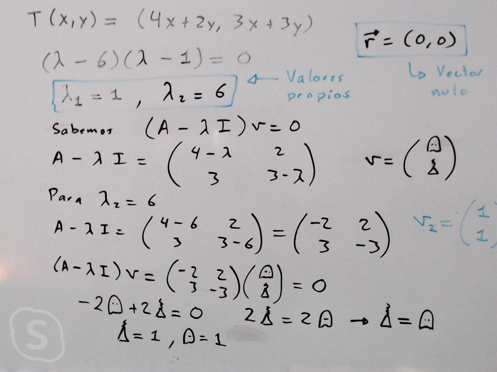
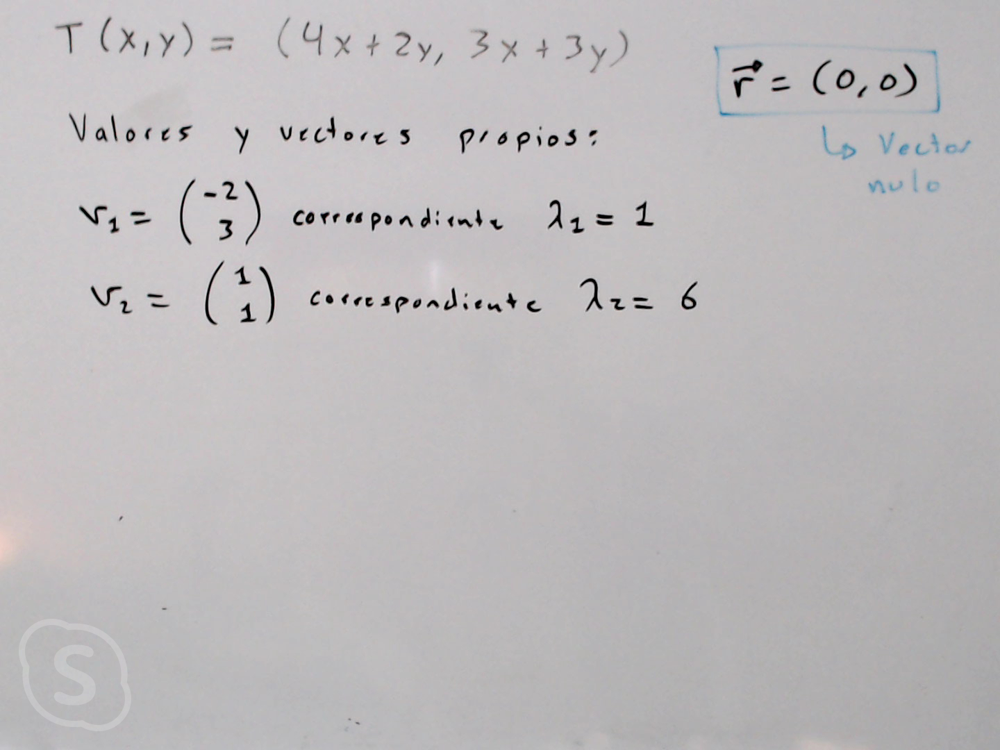

En álgebra lineal, los conceptos de valor propio (o eigenvalor) y vector propio (o eigenvector) son fundamentales y se aplican en diversas áreas, como física, estadísticas, aprendizaje automático, procesamiento de señales, entre otros. Aquí te explico brevemente cada uno de estos conceptos y también abordo la transformación lineal:

**Transformación Lineal:**
   - Una transformación lineal es una función entre dos espacios vectoriales que preserva la suma de vectores y la multiplicación por escalares.
   - Las matrices pueden representar transformaciones lineales. La aplicación de una matriz a un vector es un ejemplo común de una transformación lineal.

1. **Valor Propio (Eigenvalor):**
   - Un valor propio de una matriz es un número que representa un factor de escala por el cual un vector se estira o comprime cuando se aplica esa matriz.
   - Dada una matriz cuadrada \( A \) y un vector no nulo \( v \), si \( Av \) es un múltiplo escalar de \( v \), entonces ese escalar es un valor propio de \( A \).

2. **Vector Propio (Eigenvector):**
   - Un vector propio es un vector no nulo que se mantiene en la misma dirección después de aplicar una matriz, solo puede cambiar en magnitud (escala), no en dirección.

   Sea *T: V -> W* una transformación lineal.
   En ocasiones es muy util encontrar un vector *v* que pertenece a un espacio vectorial *V*
   tal que *Tv* y *v* sean paralelos. Es decir, se busca un vector *v* y una escalar *&lambda;* tal que se cumpla:

   **Tv = &lambda;v** ... (1)

> Múltiplo escalar de un vector en geogebra:

**Definición**

Sea A una matriz de *n x n* con componentes reales.
 El número &lambda; (real o complejo) se 
denomina valor propio de A si existe un vector diferente de cero v en ℝ
 tal que
Av = &lambda;v

El vector v ≠ 0 se denomina vector propio de A correspondiente al valor propio &lambda;.

> Ejemplo de como surgen los valores propios y vectores propios.

_**Teorema:**_ 
Sea A una matriz de _n x n_. Entonces &lambda; es un valor propio de A si y sólo si 
p(&lambda;) = det ( A -  &lambda;_I_ ) = 0

> Ejemplo de como encontrar valores propios y vectores propios.

**Aplicaciones:**
   - **Análisis de Datos:** En estadísticas y aprendizaje automático, los valores y vectores propios son utilizados para reducción de dimensionalidad, análisis de componentes principales, y descomposición espectral.
   - **Física y Ingeniería:** En mecánica cuántica, la función de onda es representada por vectores propios de operadores lineales. En ingeniería estructural, se usan para analizar modos de vibración.
   - **Procesamiento de Señales:** En el procesamiento de imágenes y señales, los valores y vectores propios se utilizan para técnicas como la transformada de Karhunen-Loève y descomposición en valores singulares.
   - **Criptografía:** Se aplican en algoritmos criptográficos, como en el cifrado RSA basado en la factorización de números grandes relacionados con valores propios.

Estos son solo algunos ejemplos, y la utilidad de estos conceptos es extensa en diversas disciplinas.